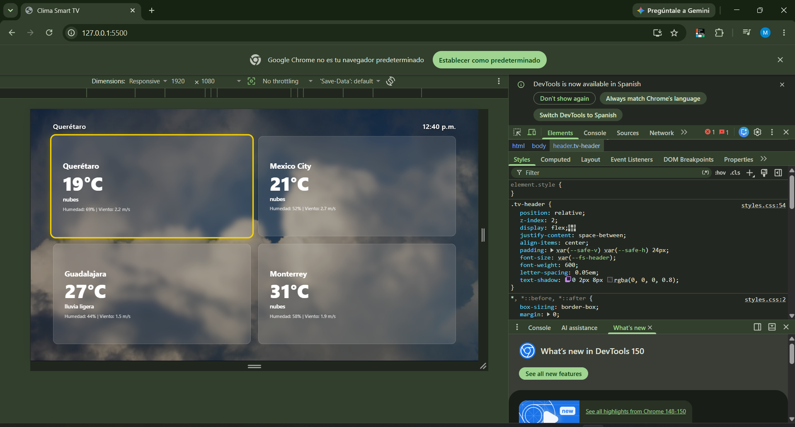
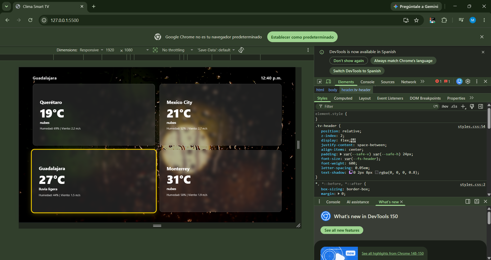
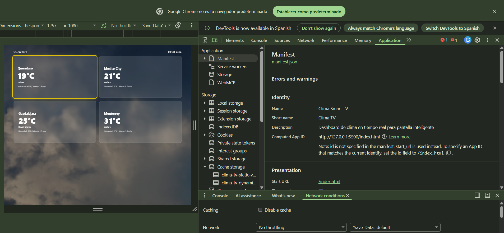
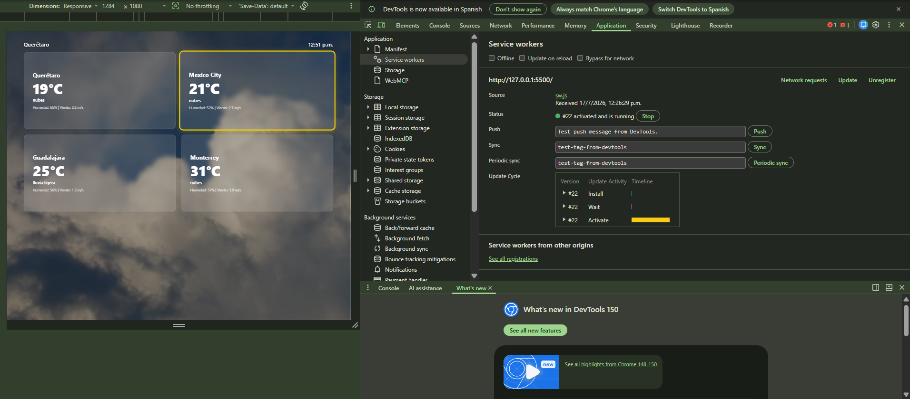
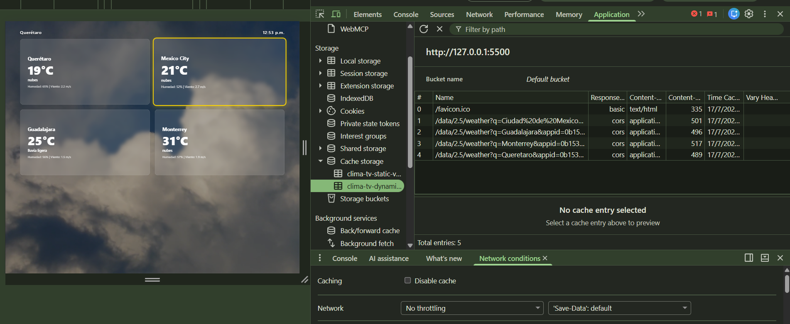
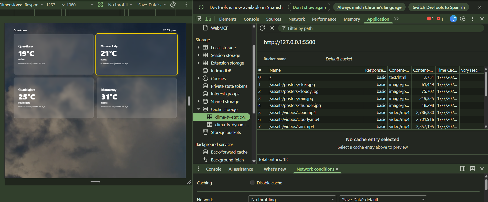
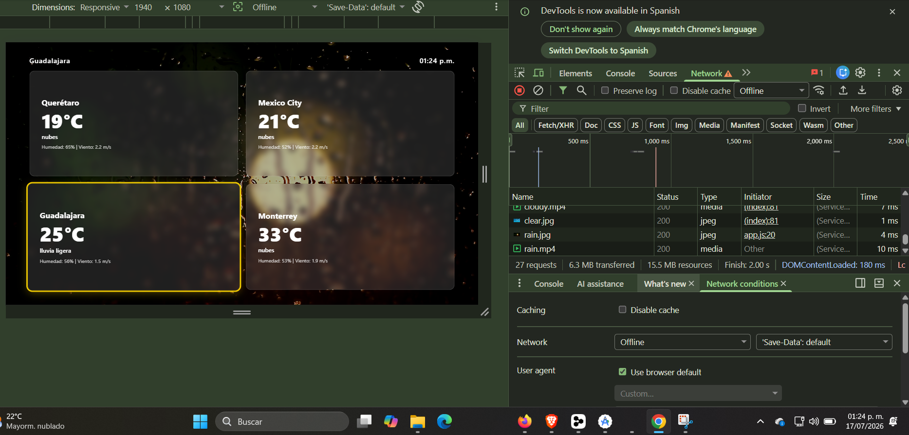

# Clima Smart TV — P3.1

PWA de clima para Smart TV (1920×1080) con navegación D-pad, video de fondo dinámico y modo offline.

## Tecnologías

- HTML5, CSS3, JavaScript (vanilla, sin frameworks)
- OpenWeatherMap API (datos en tiempo real)
- Service Worker (Cache First / Network First)
- manifest.json (instalable como app nativa)

## Estructura

```
clima-smart-tv/
├── index.html              Pantalla principal (grid 2x2)
├── manifest.json           Config PWA (fullscreen, landscape)
├── sw.js                   Service Worker
├── .env                    API key (no versionada)
├── .gitignore
├── css/
│   └── styles.css          Estilos 10-foot UI
├── js/
│   ├── config.js           Inyecta API key (no versionado)
│   ├── weather.js          Fetch a OpenWeatherMap
│   ├── navigation.js       Navegación D-pad + click
│   └── app.js              Orquestador (reloj, video, SW)
├── assets/
│   ├── videos/             clear, cloudy, rain, thunder (.mp4)
│   └── posters/            clear, cloudy, rain, thunder (.jpg)
├── icons/
│   ├── icon-192.png
│   └── icon-512.png
└── screenshots/           Evidencia de pruebas en DevTools
```

## Cómo ejecutar

```bash
# Servidor local
python -m http.server 5500

# Abrir en navegador
# http://127.0.0.1:5500
```

Se probó en **Google Chrome** con emulación de dispositivo Smart TV 1080p y en **Firefox Developer Edition**.

## Configuración

1. Copiar `.env.example` a `.env` y poner la API key de OpenWeatherMap
2. Crear `js/config.js` con:
   ```javascript
   window.ENV_API_KEY = 'tu_api_key_aqui';
   ```
3. Ambos archivos están en `.gitignore` y no se suben al repositorio

## Funcionalidades

- **4 ciudades** (Querétaro, CDMX, Guadalajara, Monterrey) con datos reales
- **Temperatura, humedad, viento y condición** por ciudad
- **Video de fondo** que cambia según el clima (Clear, Clouds, Rain, Thunderstorm)
- **Poster fallback** si el video no carga
- **Navegación D-pad**: flechas mueven foco dorado, Enter selecciona
- **Click del mouse** también mueve foco y selecciona
- **Reloj en tiempo real** (actualiza cada minuto)
- **Refresco de datos** cada 10 minutos
- **Service Worker** con tres estrategias:
  - Cache First para estáticos (HTML, CSS, JS, iconos, posters)
  - Cache First para videos
  - Network First para la API (datos frescos, fallback a cache)
- **Modo offline**: la app carga completa desde cache sin conexión

## Evidencia

### App en funcionamiento



App corriendo en Chrome con emulación Smart TV 1080p. Video de fondo nublado, grid 2x2 con datos reales de 4 ciudades, foco dorado en tarjeta seleccionada.



Al seleccionar una ciudad con lluvia, el video de fondo cambia dinámicamente.

### manifest.json válido



DevTools → Application → Manifest. Todos los campos presentes: name, short_name, display fullscreen, orientation landscape, iconos 192 y 512, theme_color, screenshots.

### Service Worker activo



DevTools → Application → Service Workers. `sw.js` en estado *activated and running*.

### Cache Storage poblado



DevTools → Application → Cache Storage. `clima-tv-static-v2` con HTML, CSS, JS, iconos, posters y videos precacheados.



`clima-tv-dynamic-v2` con respuestas de la API cacheadas (Network First con fallback).

### Modo offline



App funcionando sin conexión. DevTools → Network → Offline activado. La app carga completa desde cache: layout, videos de fondo y datos de las ciudades.

### Pruebas realizadas

- **Navegador**: Google Chrome con emulación Smart TV 1080p (1920×1080, DPR 1, UA Tizen)
- **Service Worker activo**: `sw.js` registrado y en estado *activated and running*
- **Cache Storage poblado**: `clima-tv-static-v2` con HTML, CSS, JS, iconos, posters y videos; `clima-tv-dynamic-v2` con respuestas de la API
- **Modo offline**: activando *Offline* en DevTools → la app carga completa desde cache (0 B transferidos)
- **Navegación D-pad**: flechas del teclado mueven el foco dorado entre tarjetas, Enter cambia el video de fondo
- **Click del mouse**: también mueve el foco y selecciona la tarjeta
- **API real**: 4 ciudades con temperatura, humedad, viento y condición climática en tiempo real

### Cómo probar el modo offline en Chrome

1. Cargar la app **con conexión** primero (para que el SW precachee videos y la API guarde datos en cache)
2. Abrir DevTools (`F12`)
3. Ir a la pestaña **Network**
4. En el dropdown que dice *No throttling* (junto al checkbox *Disable cache*), seleccionar **Offline**
5. Aparecerá un ícono de advertencia amarillo junto a la pestaña Network
6. Recargar la página (`Ctrl+R`)
7. La app carga completa desde cache: videos, datos y layout sin conexión a internet

## Videos de fondo

Los videos se descargaron de Pexels y Pixabay (libres de uso, sin atribución obligatoria) y se optimizaron con ffmpeg a 1920×1080, 10 segundos, H.264, sin audio, con `+faststart` para streaming web.

| Archivo | Origen | Contenido |
|---------|--------|----------|
| `clear.mp4` | Pexels | Cielo azul con nubes tenues |
| `cloudy.mp4` | Pexels | Nubes en movimiento |
| `rain.mp4` | Pixabay | Lluvia sobre ventana |
| `thunder.mp4` | Pixabay | Relámpagos y cielo oscuro |

Optimización aplicada:

```bash
ffmpeg -i origen.mp4 -t 10 -vcodec libx264 -crf 23 -preset slow -vf "scale=1920:1080,fps=30" -an -movflags +faststart clear.mp4
```

## Prácticas relacionadas

| Práctica | Relación |
|----------|----------|
| P2.3 | Modelo de datos Weather reutilizado |
| P2.5 | Misma API key y endpoints de OpenWeatherMap |
| P2.6 | Datos del wearable se integrarán en P3.3 |
| P1.3 | Mockup TV Figma 1920×1080 como referencia de UI |

## Rúbrica (100 pts)

| Criterio | Pts | Estado |
|----------|-----|--------|
| Estructura y Git | 15 | OK |
| manifest.json | 15 | OK |
| Service Worker | 20 | OK |
| Modo offline | 10 | OK |
| Layout 1920×1080 | 15 | OK |
| Datos API reales | 15 | OK |
| Video de fondo | 10 | OK |
